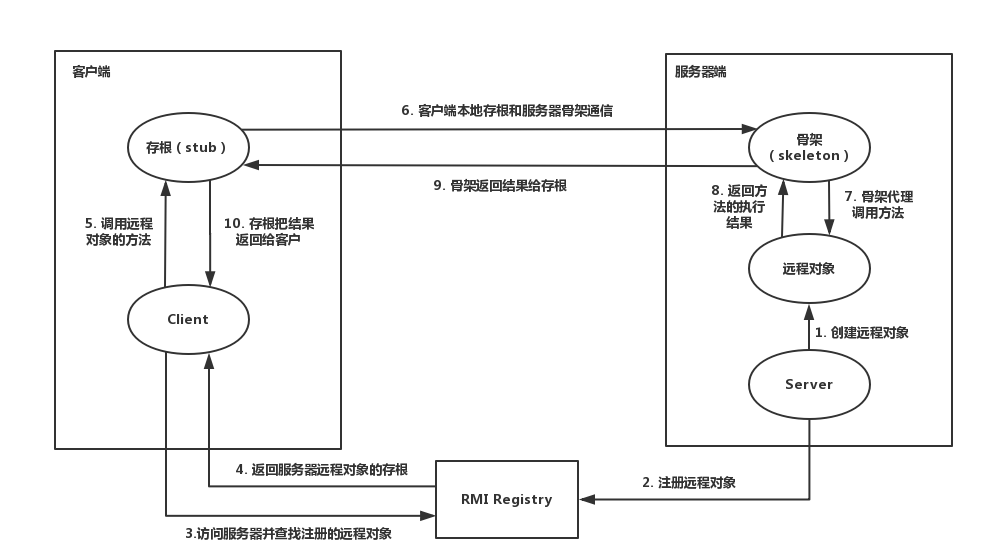
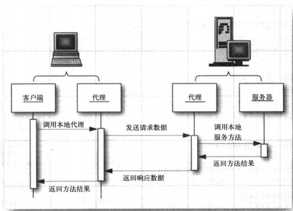
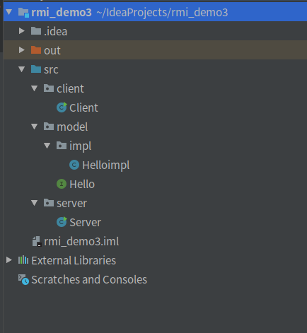
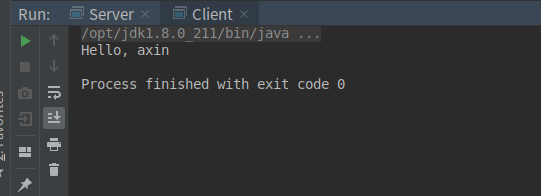

 ### 0x01基本概念

 RMI的全称是Rmote Method Invocation,即远程方法调用，具体怎么实现呢？远程服务器提供具体的类和方法，本地会通过**某种方式**获得远程类的一个代理，然后通过这个代理调用远程对象的方法，方法的参数是通过序列化与反序列化的方式传递的，所以，**1.** 只要服务端的对象提供了一个方法，这个方法接收的是一个Object类型的参数，**2.** 且远程服务器的classpath中存在可利用pop链，那么我们就可以通过在客户端调用这个方法，并传递一个精心构造的对象的方式来攻击rmi服务。

### 0x02 实现机制

上面说了本地会通过某种方式获得远程对象的代理，那么具体是怎么的实现机制呢？RMI模式中除了有Client与Server,还借助了一个Registry(注册中心)。

|Server|Registry|Client|
|:-:|:-:|:-:|
|提供具体的远程对象|一个注册表，存放着远程对象的位置（ip、端口、标识符）|远程对象的使用者|

其中Server与Registry可以在同一服务器上实现，也可以布置在不同服务器上，现在一个完整的RMI流程可以大概描述为：

1. Registry先启动，并监听一个端口，一般为1099 
2. Server向Registry注册远程对象
2. Client从Registry获得远程对象的代理（这个代理知道远程对象的在网络中的具体位置：ip、端口、标识符），然后Client通过这个代理调用远程方法，Server也是有一个代理的，Server端的代理会收到Client端的调用的方法、参数等，然后代理执行对应方法，并将结果通过网络返回给Client。


两图胜千言：

整体流程：

ps: 图中的stub就是客户端代理，skeleton就是服务端代理，老外起的这英文名字我实在是理解不了～

远程方法调用的通信模式：



> 不知道有没有人和我一样想过为什么需要这个注册表？

### 0x03 代码实现

我们已经知道了大体的流程了，那么用代码如何实现上述流程呢?我们自己动手创建一个项目吧，项目结构如下：



1.首先创建一个接口Hello:

```java
package model;

import java.rmi.Remote;
import java.rmi.RemoteException;

public interface Hello extends Remote {
    public String welcome(String name) throws RemoteException;
}

```

2.基于这个接口实现一个类Helloimpl：

```java
package model.impl;

import model.Hello;

import java.rmi.RemoteException;
import java.rmi.server.UnicastRemoteObject;

public class Helloimpl extends UnicastRemoteObject implements Hello {
    public Helloimpl() throws RemoteException {
    }

    @Override
    public String welcome(String name) throws RemoteException {
        return "Hello, "+name;
    }
}
```

3.创建服务端，服务端创建了一个注册表，并注册了客户端需要的对象

```java
package server;

import model.Hello;
import model.impl.Helloimpl;
import java.rmi.RemoteException;
import java.rmi.registry.LocateRegistry;
import java.rmi.registry.Registry;

public class Server {
    public static void main(String[] args) throws RemoteException{
        // 创建对象
        Hello hello = new Helloimpl();
        // 创建注册表
        Registry registry = LocateRegistry.createRegistry(1099);
        // 绑定对象到注册表，并给他取名为hello
        registry.rebind("hello", hello);
    }
}
```

4.客户端调用远程对象

```java
package client;
import model.Hello;
import java.rmi.NotBoundException;
import java.rmi.RemoteException;
import java.rmi.registry.LocateRegistry;
import java.rmi.registry.Registry;

public class Client {
    public static void main(String[] args) throws RemoteException, NotBoundException {
        // 获取到注册表的代理
        Registry registry = LocateRegistry.getRegistry("localhost", 1099);
        // 利用注册表的代理去查询远程注册表中名为hello的对象
        Hello hello = (Hello) registry.lookup("hello");
        // 调用远程方法
        System.out.println(hello.welcome("axin"));
    }
}
```

先启动服务端，在启动客户端，客户端成功执行远程方法并获得返回的数据：



在写代码的时候有几点需要注意：
1. 接口需要集成Remote接口，且方法需要抛出RemoteException错误
2. 接口的实现类需要继承UnicastRemoteObject，同样的方法需要抛出RemoteException错误
3. 如果远程方法需要传参，需要保证参数是可序列化的，我这里传参只是传了字符串，字符串是可序列化的，如果传参是自定义的对象，那么这个对象需要实现Serilizable接口

注意一点，由于我这里服务端与客户端都是在一台机器上实现的，所以看起来比较简单，如果服务端与客户端不在同一主机，需要保证调用的远程对象实现的那个接口在客户端与服务端都存在！

### 0x04 其他

到这里就差不多了，暂时满足我们后续学习rmi反序列化漏洞的需要，如果好奇rmi底层代码实现，可以再去读一下jdk的源码，这样会加深你对rmi的理解～

放一篇从源码层面解析rmi实现的文章：https://xz.aliyun.com/t/2223

看文章的同时，最好结合着实践


