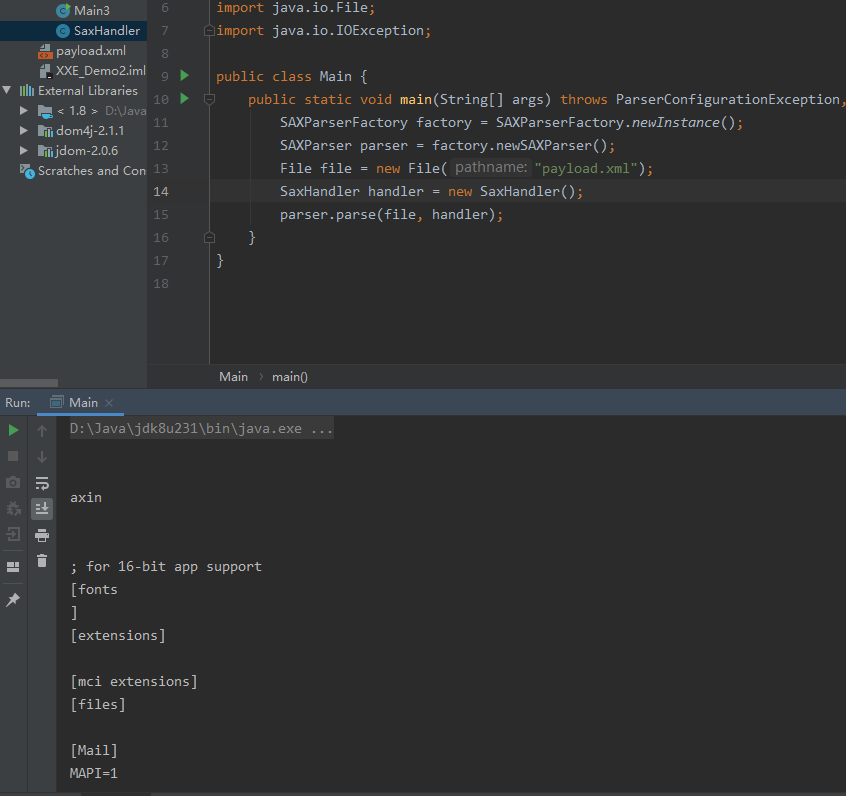

### 0x01 前言

之前我们学习了DocumentBuilder这个XML解析类的使用方法，还展示了如何读取本地文件以及利用XXE外带数据，当然，也简单的提到了相应的防御方法，这一章，我们将学习其他一些JAVA中常用的XML解析方法。

### 0x02 javax.xml.parsers.SAXParser

使用方法如下：

```java
import org.xml.sax.SAXException;

import javax.xml.parsers.ParserConfigurationException;
import javax.xml.parsers.SAXParser;
import javax.xml.parsers.SAXParserFactory;
import java.io.File;
import java.io.IOException;

public class Main {
    public static void main(String[] args) throws ParserConfigurationException, SAXException, IOException {
        SAXParserFactory factory = SAXParserFactory.newInstance();
        SAXParser parser = factory.newSAXParser();
        File file = new File("payload.xml");
        SaxHandler handler = new SaxHandler();
        parser.parse(file, handler);
    }
}
```

其中payload.xml还是上一章的那个xml文件，值得注意的的是，SaxParser在调用parse方法的时候有两个参数，其中一个是文件，另外一个是对应的handler，这个handler是我们自定义的，实现如下：

```java
import org.xml.sax.Attributes;
import org.xml.sax.SAXException;
import org.xml.sax.helpers.DefaultHandler;

public class SaxHandler extends DefaultHandler {
    @Override
    public void startDocument() throws SAXException {
        super.startDocument();
    }

    @Override
    public void endDocument() throws SAXException {
        super.endDocument();
    }

    @Override
    public void startElement(String uri, String localName, String qName, Attributes attributes) throws SAXException {
        super.startElement(uri, localName, qName, attributes);
    }

    @Override
    public void endElement(String uri, String localName, String qName) throws SAXException {
        super.endElement(uri, localName, qName);
    }

    //  此方法有三个参数
    //       arg0是传回来的字符数组，其包含元素内容
    //       arg1和arg2分别是数组的开始位置和结束位置
    @Override
    public void characters(char[] ch, int start, int length) throws SAXException {
        String content = new String(ch, start, length);
        System.out.println(content);
        super.characters(ch, start, length);
    }
}
```

该类继承自DefaultHandler，然后重写了几个比较关键的方法，当然不充些也是ok的，根据这些方法名大家应该能猜出这些方法的作用，比如startDocument这个方法，作用是当解析到xml文档开始处会执行这个方法，startElement就是解析到xml的Element开始处会被触发。这些方法都是自由定制的，可发挥空间很大~

运行主类，控制到得到如下结果，成果读取到本地文件win.ini，说明XXE成功。



### 0x03 org.dom4j.io.SAXReader

这是一个第三方的类，我们需要下载对应的jar包：

https://dom4j.github.io/

使用方法：

```java
import org.dom4j.Document;
import org.dom4j.DocumentException;
import org.dom4j.Element;
import org.dom4j.io.SAXReader;

import javax.xml.parsers.SAXParser;
import java.io.File;
import java.util.List;

public class Main2 {
    public static void main(String[] args) throws DocumentException {
        File file = new File("./payload.xml");
        SAXReader saxReader = new SAXReader();
        Document document = saxReader.read(file);
        // 获得根元素
        Element root = document.getRootElement();
        // 获得根元素中的子元素
        List<Element> childs = root.elements();
        // 遍历子元素，并打印出对应的键值
        for (Element child:childs){
            String name = child.getName();
            String text = child.getText();
            System.out.println(name + ": " + text);
        }
    }
}
```


### 0x03 org.jdom2.input.SAXBuilder

同样是第三方类，下载jar包：

http://www.jdom.org/dist/binary/jdom-2.0.6.zip

使用方法：

```java
import org.jdom2.Document;
import org.jdom2.Element;
import org.jdom2.JDOMException;
import org.jdom2.input.SAXBuilder;

import java.io.File;
import java.io.IOException;
import java.util.List;

public class Main3 {
    public static void main(String[] args) throws JDOMException, IOException {
        File file = new File("./payload.xml");
        SAXBuilder saxBuilder = new SAXBuilder();
        Document document = saxBuilder.build(file);
        Element root = document.getRootElement();
        List<Element> childs = root.getChildren();
        for(Element child:childs){
            String name = child.getName();
            String text = child.getText();
            System.out.println(name+": "+text);
        }
    }
}
```

### 0x4 总结

其实能够解析xml的类库还有很多，这里只是列举了几个，更多可以参考:

https://github.com/OWASP/CheatSheetSeries/blob/master/cheatsheets/XML_External_Entity_Prevention_Cheat_Sheet.md

知道了这些类怎么解析xml，**我们在审计的时候就可以搜索对应的jar包，然后进一步看xml解析的类有没有被调用，被调用了然后再看对应的接口参数是否可控，如果可控还要观察这些解析类有没有相应的防御措施，比如禁用了外部实体等等**，关于XXE的防御，我们另起一节单独说说....

**引申阅读：**

https://github.com/OWASP/CheatSheetSeries/blob/master/cheatsheets/XML_External_Entity_Prevention_Cheat_Sheet.md
